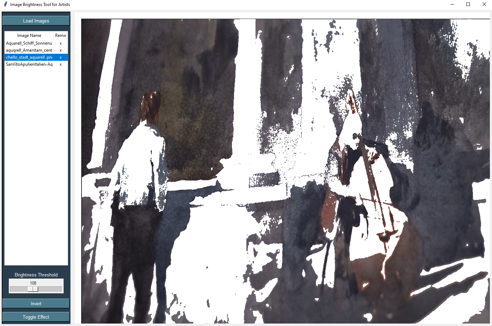

# Watercolor Artist Tool

## Overview
This Python-based tool is designed to assist watercolor artists in visualizing the light and dark areas of an image. 
It provides a simple and intuitive graphical user interface (GUI) to load images, adjust their brightness levels, and apply inversion effects. 
The tool is especially helpful for identifying and highlighting the brightness values of different regions within an image, 
thereby aiding artists in planning their watercolor compositions.

## Features
- **Load Multiple Images:** Users can load multiple images into the tool for analysis.
- **Brightness Adjustment:** A slider allows users to set a brightness threshold. Pixels brighter than this threshold will be turned white, highlighting the lighter areas of the image.
- **Interactive GUI:** The tool features a list sidebar for easy navigation among loaded images and a canvas area where the adjusted images are displayed.
- **Inversion Effect:** A toggle button to invert the brightness effect, turning darker areas white instead of the lighter ones.
- **Effect Toggle:** Users can enable or disable the brightness effect to compare the original and modified images.
- **Keyboard Controls:** The brightness slider can be adjusted using the left and right arrow keys for finer control.
- **Automatic Image Persistence:** Images are automatically saved in the "images" folder upon modification.
- **Remove Images:** Users can remove images both from the GUI and the "images" folder.

## Installation
To set up the Watercolor Artist Tool, you can use the install.bat app on windows or follow these steps:

1. **Clone the Repository:**

2. **Set Up a Virtual Environment (Optional):**
- Windows:
  ```
  python -m venv venv
  venv\Scripts\activate
  ```
- macOS/Linux:
  ```
  python3 -m venv venv
  source venv/bin/activate
  ```
3. **Install Dependencies:**
  ```
  pip install -r requirements.txt
  ```
## Usage
Run the main script to start the application:
```
python main.py
```
or use the start_main.bat app on windows.

Once the application is running:
- Use the 'Load Images' button to select and load images.
- Click on an image in the sidebar to view it in the main canvas.
- Adjust the brightness threshold using the slider to highlight bright areas.
- Use the 'Invert' button to invert the brightness effect.
- Toggle the brightness effect on and off with the 'Toggle Effect' button.
- Resize the window to scale the displayed image.
- Use the left and right arrow keys for fine adjustment of the brightness slider.
- Remove images using the 'Remove' button next to each image.

## Technologies
- Python
- Tkinter for the GUI
- Pillow for image processing

## Planned Features
- Proportion feedback: Overlay original and drawing image. Drawing image should only cut out lines. 
The aim is to visualize the correct proportions of your drawing. This will improve your drawing skills and your sense of perspective 

## Contributing
Contributions to the Watercolor Artist Tool are welcome! 

## License
This project is licensed under the [MIT License](LICENSE.md) - see the `LICENSE.md` file for details.

## Acknowledgments
- Mention any third-party assets or contributors here.

## Preview:

